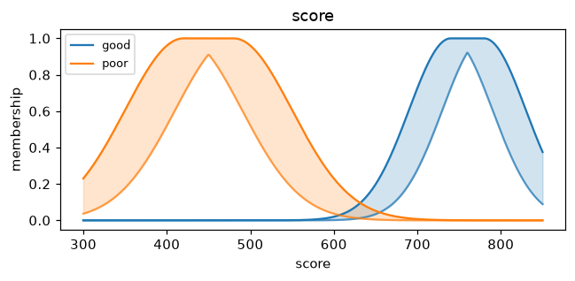
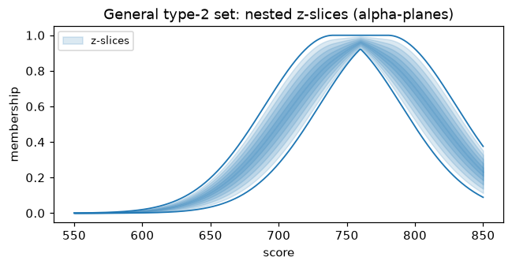

# Interval type-2 (IT2)

A type-1 fuzzy set assigns each point a single membership degree. An **interval
type-2** set assigns an *interval* `[lower, upper]`: it is bounded by a lower
membership function (LMF) and an upper membership function (UMF), and the gap
between them is the **footprint of uncertainty (FOU)**. This models uncertainty
about the membership function itself — useful when "good" or "high" has no sharp,
agreed-upon definition.

IT2 rules use the **same operator syntax** as type-1 rules; only the membership
functions and the engine change.

## Building IT2 sets

```python
import fuzzytool as fz

# A Gaussian whose mean is uncertain across [630, 680]:
fair = fz.it2_gauss_uncertain_mean(630, 680, sigma=60)

# A Gaussian with uncertain spread:
mid = fz.it2_gauss_uncertain_std(5.0, sigma_lo=0.8, sigma_hi=1.4)

# Height uncertainty: LMF is a scaled-down copy of a type-1 MF:
hi = fz.it2_scale(fz.gauss(8, 1.5), scale=0.6)

# Or supply the lower and upper MFs explicitly:
custom = fz.it2(lower=fz.tri(2, 5, 8), upper=fz.tri(0, 5, 10))
```

Membership is an interval — `fair(650)` returns `(lower, upper)`; the engines
also read `fair.lower(x)` and `fair.upper(x)`.

## IT2 inference

[`IT2Mamdani`][fuzzytool.type2.inference.IT2Mamdani] uses **center-of-sets** type
reduction; [`IT2TSK`][fuzzytool.type2.inference.IT2TSK] type-reduces crisp
consequents directly. Both return the midpoint of the type-reduced interval
`[y_l, y_r]`.

```python
score   = fz.Variable("score", (300, 850))
score["good"] = fz.it2_gauss_uncertain_mean(740, 780, 50)
score["poor"] = fz.it2_gauss_uncertain_mean(420, 480, 70)
premium = fz.Variable("premium", (0, 12))
premium["low"]  = fz.it2_gauss_uncertain_mean(1.5, 2.5, 1.5)
premium["high"] = fz.it2_gauss_uncertain_mean(9.5, 10.5, 1.5)

sys = fz.IT2Mamdani()
sys.rule(score["good"], premium["low"])
sys.rule(score["poor"], premium["high"])
sys(score=780)    # -> 2.29  (midpoint of the type-reduced interval)
```

A ready-made example is [`fuzzytool.datasets.credit_risk_it2`][fuzzytool.datasets].

## Type reduction (Karnik-Mendel)

Type reduction collapses the interval-valued output into a crisp interval
`[y_l, y_r]`. fuzzytool implements the **Karnik-Mendel** algorithm as a single
reusable primitive ([`fuzzytool.type2.reduction`][fuzzytool.type2.reduction]):
`km_endpoint` finds one endpoint, `karnik_mendel` returns both, and
`centroid_it2` applies it to compute an IT2 set's centroid interval.

```python
import numpy as np
from fuzzytool.type2.reduction import centroid_it2

good = fz.it2_gauss_uncertain_mean(740, 780, 50)
universe = np.linspace(300, 850, 400)
centroid_it2(good, universe)   # -> (738.05, 772.07), the [y_l, y_r] centroid interval
```

## Visualization

```python
import matplotlib.pyplot as plt
from fuzzytool import viz

viz.plot_it2_variable(score)   # draws each term's LMF/UMF with a shaded FOU
plt.show()
```



## General type-2 (zSlices)

An IT2 set treats every point inside its FOU as equally possible. A **general
type-2** set adds a *secondary* membership that weights those possibilities —
the third dimension IT2 discards. fuzzytool represents a GT2 set with the
**zSlices / alpha-plane** decomposition: slicing the secondary domain at levels
`z` turns the GT2 set into a stack of ordinary IT2 sets, so inference and type
reduction reuse the IT2 machinery and combine the slices weighted by `z`.

Each constructor builds a GT2 set from an IT2 footprint plus a **triangular
secondary** peaking at the principal (mid) MF — narrow at `z = 1`, the full FOU
at `z → 0`:

```python
import fuzzytool as fz

score = fz.Variable("score", (300, 850))
score["good"] = fz.gt2_gauss_uncertain_mean(740, 780, 50, n_slices=5)
score["poor"] = fz.gt2_gauss_uncertain_mean(420, 480, 70, n_slices=5)
premium = fz.Variable("premium", (0, 12))
premium["low"]  = fz.gt2_gauss_uncertain_mean(1.5, 2.5, 1.5)
premium["high"] = fz.gt2_gauss_uncertain_mean(9.5, 10.5, 1.5)

sys = fz.GeneralType2Mamdani()
sys.rule(score["good"], premium["low"])
sys.rule(score["poor"], premium["high"])
sys(score=780)    # -> 2.31  (z-weighted average of per-slice IT2 results)
```



A GT2 term also exposes `lower`/`upper` (its overall FOU), so it can stand in for
its IT2 footprint inside an `IT2Mamdani` if you want the cheaper approximation.
Build a GT2 set from *any* IT2 footprint with
[`gt2_from_it2`][fuzzytool.type2.general.gt2_from_it2], and type-reduce a single
GT2 set with `centroid_gt2`:

```python
import numpy as np
from fuzzytool.type2 import centroid_gt2

good = fz.gt2_gauss_uncertain_mean(740, 780, 50, n_slices=6)
universe = np.linspace(300, 850, 400)
centroid_gt2(good, universe)   # -> ~754.7  (z-weighted centroid)
```
