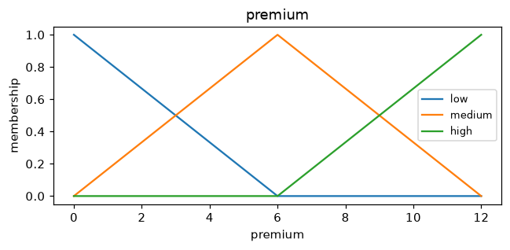
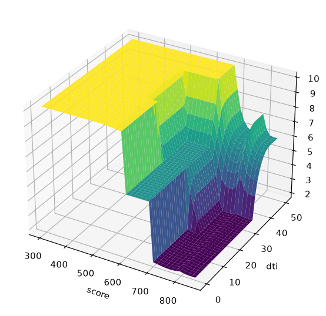

# Visualization

`fuzzytool.viz` needs matplotlib: `pip install fuzzytool[viz]`.

## Membership functions

```python
import matplotlib.pyplot as plt
import fuzzytool as fz
from fuzzytool import viz

premium = fz.Variable("premium", (0, 12), terms=["low", "medium", "high"])
viz.plot_variable(premium)
plt.show()
```



## Control surface

For a single-output system over two inputs:

```python
from fuzzytool import datasets, viz

sys, score, dti, premium = datasets.credit_risk()
viz.control_surface(sys, score, dti)
plt.show()
```


