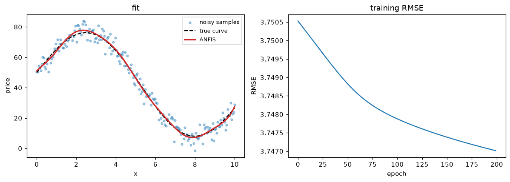

# Tutorial: learning a fuzzy model from data with ANFIS

When you *don't* know the rules but *do* have data, let the system learn them.
[`ANFIS`][fuzzytool.anfis.ANFIS] is a first-order Takagi-Sugeno system whose
membership functions and consequents are fit from samples (Jang, 1993). Here we
recover a nonlinear "fair price" curve hidden under noise.

## 1. Make a noisy dataset

A smooth but nonlinear target, observed with Gaussian noise:

```python
import numpy as np
import fuzzytool as fz

rng = np.random.default_rng(0)
x = np.linspace(0, 10, 200)
true  = 50 + 30 * np.sin(0.6 * x) - 1.5 * x      # the curve we want to recover
noisy = true + rng.normal(0, 4, size=x.shape)    # what we actually observe
```

## 2. Fit ANFIS

`X` is always 2-D `(n_samples, n_features)`. Six Gaussian membership functions on
one input give six rules:

```python
model = fz.ANFIS(n_inputs=1, n_mf=6).fit(x[:, None], noisy, epochs=200)
pred = model.predict(x[:, None])
```

## 3. Read the training history

`history_` is the RMSE per epoch *against the noisy targets*, so it bottoms out
near the noise level (≈ 4) — that floor is expected, not a failure to learn:

```python
model.history_[0], model.history_[-1]   # -> (3.751, 3.747)
```

The real test is how close the prediction is to the **true, noise-free** curve:

```python
np.sqrt(np.mean((pred - true) ** 2))    # -> 0.864  (the noise is largely averaged out)
```

## 4. Visualize the fit

```python
import matplotlib.pyplot as plt

fig, (ax1, ax2) = plt.subplots(1, 2, figsize=(11, 4))
ax1.scatter(x, noisy, s=10, alpha=0.4, label="noisy samples")
ax1.plot(x, true, "k--", label="true curve")
ax1.plot(x, pred, "C3", lw=2, label="ANFIS")
ax1.legend()
ax2.plot(model.history_)
ax2.set_xlabel("epoch"); ax2.set_ylabel("RMSE")
plt.show()
```



## Notes

- Because the rule count grows as `n_mf ** n_inputs`, ANFIS suits
  low-dimensional problems; keep `n_mf` modest as inputs grow.
- `ANFIS` follows the scikit-learn estimator protocol, so it drops into a
  `Pipeline` or `GridSearchCV` — see [Batch, I/O & sklearn](../guide/batch-and-io.md).
