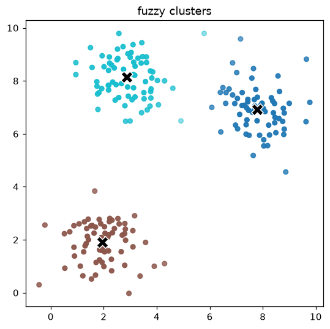

# Tutorial: customer segmentation with fuzzy clustering

Crisp k-means forces every customer into exactly one segment. **Fuzzy c-means**
instead gives each customer a graded membership in every segment — useful when
boundaries are blurry. This tutorial segments a 2-D dataset and uses validity
indices to choose how many segments there really are.

## 1. Get some 2-D data

We use the bundled `make_blobs` helper; in practice these would be two scaled
features (say monthly spend and tenure):

```python
import fuzzytool as fz
from fuzzytool import cluster
from fuzzytool.datasets import make_blobs

X = make_blobs(centers=((2, 2), (8, 7), (3, 8)), n_per=70, spread=0.9, seed=1)
```

## 2. How many segments? Sweep `c`

Run the algorithm for a range of cluster counts and compare two internal
validity indices: the **partition coefficient** (higher = crisper) and
**Xie-Beni** (lower = better):

```python
for c in range(2, 6):
    res = fz.fuzzy_cmeans(X, c=c, m=2.0, seed=0)
    pc = cluster.partition_coefficient(res.u)
    xb = cluster.xie_beni(X, res.centers, res.u)
    print(f"c={c}: PC={pc:.3f}  XB={xb:.3f}")
```

```text
c=2: PC=0.826  XB=0.115
c=3: PC=0.884  XB=0.045   <- best: highest PC, lowest XB
c=4: PC=0.780  XB=0.450
c=5: PC=0.684  XB=0.627
```

`c=3` maximizes the partition coefficient *and* minimizes Xie-Beni, so three
segments is the natural choice.

## 3. Fit and inspect the chosen model

```python
res = fz.fuzzy_cmeans(X, c=3, m=2.0, seed=0)

res.centers   # (3, 2) segment prototypes
res.u         # (3, n) membership matrix, columns sum to 1
res.labels    # hard assignment (argmax over u), handy for coloring
```

## 4. Visualize the segments

Point opacity encodes the top membership, so customers on a boundary between two
segments appear fainter:

```python
import matplotlib.pyplot as plt
from fuzzytool import viz

viz.plot_clusters(X, res)
plt.show()
```



## Where to go next

- Try [`gustafson_kessel`][fuzzytool.cluster.gustafson_kessel] for elongated
  (ellipsoidal) segments, or
  [`possibilistic_cmeans`][fuzzytool.cluster.possibilistic_cmeans] when the data
  has outliers — see [Fuzzy clustering](../guide/clustering.md).
- Feed the learned memberships into a fuzzy rule base as soft features.
