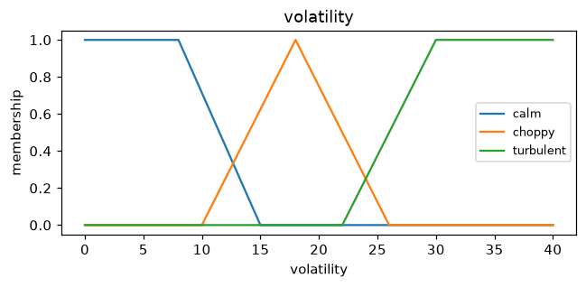
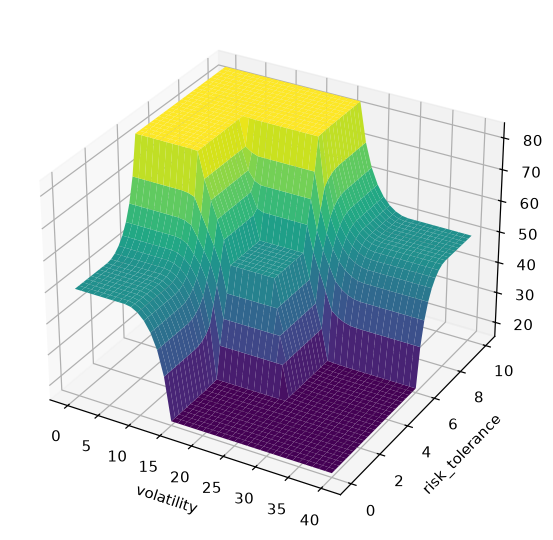

# Tutorial: a fuzzy investment-risk advisor

This end-to-end tutorial builds a small **Mamdani** controller that recommends how
much of a portfolio to hold in equities, given current **market volatility** and
the investor's **risk tolerance**. Along the way you touch most of the toolkit:
variables, operator rules, inference, visualization, batch evaluation and
save/load.

## 1. Model the problem as linguistic variables

Two inputs and one output. Each variable is a named universe carrying fuzzy
*terms*:

```python
import fuzzytool as fz

volatility = fz.Variable("volatility", (0, 40))   # annualized %
volatility["calm"]      = fz.trap(0, 0, 8, 15)
volatility["choppy"]    = fz.tri(10, 18, 26)
volatility["turbulent"] = fz.trap(22, 30, 40, 40)

risk_tolerance = fz.Variable("risk_tolerance", (0, 10))
risk_tolerance["cautious"]   = fz.trap(0, 0, 2, 4)
risk_tolerance["balanced"]   = fz.tri(3, 5, 7)
risk_tolerance["aggressive"] = fz.trap(6, 8, 10, 10)

equity = fz.Variable("equity", (0, 100))   # % of portfolio in stocks
equity["light"]    = fz.tri(0, 15, 35)
equity["moderate"] = fz.tri(30, 50, 70)
equity["heavy"]    = fz.tri(65, 85, 100)
```

## 2. Write the rule base

Rules read like plain logic — `&` is AND, `|` is OR, `~` is NOT:

```python
sys = fz.Mamdani(defuzz="centroid")
sys.rule(volatility["turbulent"] | risk_tolerance["cautious"], equity["light"])
sys.rule(volatility["choppy"] & risk_tolerance["balanced"], equity["moderate"])
sys.rule(volatility["calm"] | risk_tolerance["aggressive"], equity["heavy"])
```

## 3. Advise individual investors

The system is callable; pass crisp inputs by name:

```python
sys(volatility=6,  risk_tolerance=8)   # -> 83.3%  (calm market, bold investor)
sys(volatility=18, risk_tolerance=5)   # -> 50.0%  (choppy, balanced)
sys(volatility=32, risk_tolerance=3)   # -> 16.7%  (turbulent, cautious)
```

## 4. See the whole decision surface

```python
import matplotlib.pyplot as plt
from fuzzytool import viz

viz.plot_variable(volatility)
viz.control_surface(sys, volatility, risk_tolerance)
plt.show()
```





## 5. Score a whole book of clients at once

`predict` vectorizes the same logic over arrays — one row per investor:

```python
import numpy as np

vols = np.array([6.0, 18.0, 32.0])
tols = np.array([8.0,  5.0,  3.0])
sys.predict(volatility=vols, risk_tolerance=tols)   # -> array([83.3, 50. , 16.7])
```

## 6. Persist the advisor

Serialize the tuned system to JSON and reload it elsewhere:

```python
fz.save(sys, "advisor.json")
restored = fz.load("advisor.json")
restored(volatility=18, risk_tolerance=5)   # -> 50.0
```

## Where to go next

- Swap `defuzz="centroid"` for `"bisector"` or `"mom"` — see
  [Defuzzification](../guide/defuzzification.md).
- Model *uncertain* term definitions with [interval type-2](../guide/type2.md) sets.
- Learn a rule base from historical data instead of writing it by hand:
  [Rule learning](../guide/rule-learning.md).
